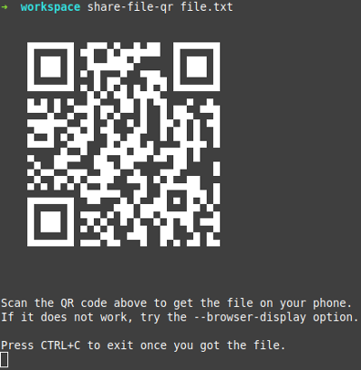

# share-file-qr

Share files from the terminal of your computer to a smartphone by scanning a QR code.

This repo is a Python re-implementation of the original [Go version](https://github.com/claudiodangelis/qr-filetransfer)
by [Claudio d'Angelis](https://claudiodangelis.com/).

## Installation

This program requires Python 3.9 or later.

Installation:
* `pipx install share-file-qr`
  * find install instructions for [pipx](https://pypa.github.io/pipx/installation/) on their website

## Principle

The principle is the same as in the Go version:
1. you give a file to the tool in your computer's terminal
2. the tool serves this file with an HTTP server
3. the tool gives you a QR code leading to the URL. This URL points to the server
   and the file on the local network.
4. you scan the QR code with your smartphone and get the URL to your file
5. you open the URL with your smartphone's web browser, and download starts
6. once download finishes on your smartphone, you stop the tool in your terminal

## Usage

First, make sure your computer and your smartphone are connected to the same local
network. This is in general the case if they are connected to the same router in your
home. If you have doubts, check their IP addresses. Please also be aware that
this tool does not work with IPv6.

Once connectivity issues are solved, run the tool by providing a file:

At this point, you should have a QR code displayed directly in your terminal, or in
your computer's browser as an SVG image.

Once you have a QR code (either directly from the terminal or from your computer's
browser) scan it with your smartphone to get a URL to the file and download it in
your web browser. Depending on your phone's OS you may have to scan the QR
code differently:
* iOS, use the standard camera app
* Android: try [Binary Eye](https://play.google.com/store/apps/details?id=de.markusfisch.android.binaryeye)
  by [Markus Fish](http://www.markusfisch.de)

## Development notes

### License

GPLv3

### Authors

This Python tool was implemented by [Pierre Walch](http://pwal.ch),
based on ideas from a Go project by [Claudio d'Angelis](https://github.com/claudiodangelis/qr-filetransfer).

### Instructions for publishing to PyPI

* enter the venv of the project
* `python setup.py sdist`
* test: `twine upload -r testpypi dist/*`
* real: `twine upload dist/*`
